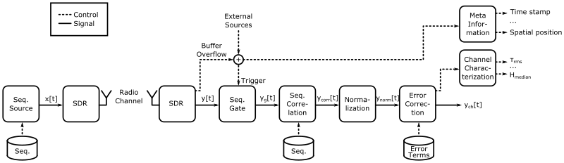
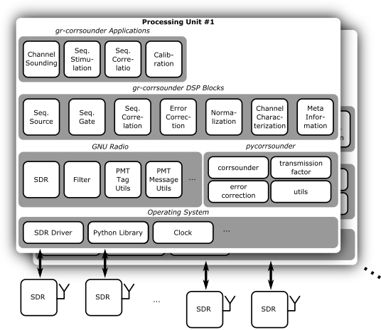

# gr-corrsounder





# Requirements

 * GNU Radio
 * python package psutil
 * python package scipy

# Build/Install instructions

0. Recommended installing an old version of Ubuntu (18.04) to support the legacy code of the corrsounder.
  * Download [Ubuntu 18.04](https://releases.ubuntu.com/18.04/)
  * Create VM VirtualBox machine
  * insert iso
  * after installing and rebooting, insert Guest Additions iso
  * `sudo apt install perl gcc make`
  * run iso
  * reboot
  

1. Install/Build GNU Radio (it is recommended to use [PyBOMBS](https://github.com/gnuradio/pybombs))

```sh
sudo apt install python
sudo apt install python-pip
sudo pip install mako requests numpy
sudo apt install python3
sudo apt install python3-pip 
sudo apt install python-qt4 libqt4-dev libqwt-dev libcppunit-dev python-gtk2
sudo pip3 install --upgrade git+https://github.com/gnuradio/pybombs.git
sudo pip install Cheetah
pybombs auto-config
pybombs recipes add gr-recipes git+https://github.com/gnuradio/gr-recipes.git
pybombs recipes add gr-etcetera git+https://github.com/gnuradio/gr-etcetera.git
pybombs config --package gnuradio gitrev maint-3.7
pybombs prefix init ~/prefix-3.7 -R gnuradio-default
source ~/prefix-3.7/setup_env.sh
```

2. Get *gr-corrsounder* from github - `git clone https://github.com/gillesC/gr-corrsounder.git`

3. Optional: Change to which prefix *gr-corrsounder* shall be installed - `source ~/corrsounder_prefix/setup_env.sh`

4. Configure *gr-corrsounder* - `mkdir build && cd build && cmake ../`

5. Build and install *gr-corrsounder* - `make && sudo make install` 

# Uninstall/Remove instructions

1. Navigate to gr-corrsounder/build

2. Optional: Change from which prefix *gr-corrsounder* shall be uninstalled - `source ~/corrsounder_prefix/setup_env.sh`

3. Uninstall *gr-corrsounder* - `sudo make uninstall`

4. Delete the gr-corrsounder folder

# Contributors

 * Niels Fliedner
 * Dimitri Block
 * [Gilles Callebaut](github.com/GillesC)

# References
1. N. H. Fliedner, D. Block and U. Meier, "A Software-Defined Channel Sounder for Industrial Environments with Fast Time Variance," 2018 15th International Symposium on Wireless Communication Systems (ISWCS), 2018, pp. 1-6, doi: 10.1109/ISWCS.2018.8491207. [Arxiv preprint](https://arxiv.org/abs/1805.01236)
